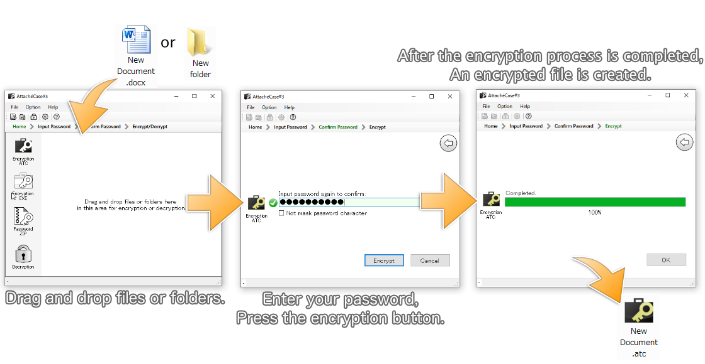

# AttachéCase#3
File encryption software for Windows XP/Vista/7/8/10   
１． Support from Microsoft have been terminated, but the application can execute even on Windows XP.   
２． To run this application that requires .NET Framework 4.0 Full, but installer download the .NET Framework 4.0 full automatically if it doesn't exist in your PC.

## Summary
AttachéCase#3 is focusing on using daily, simplicity and simple operability of appearance, is a powerful file / folder encryption software that uses a cryptographic algorithm of the world standard ( AES - Advanced Encryption Standard ).

## Just 3-step to encryption of files
Just three steps to the encryption.

Just drag and drop the file, can easily be encrypted. If you drag and drop each folder, combined into one to create an encrypted file.

Because at the time of encryption takes compression to the data, the size will be compact.

Decryption (uncompress) also you could drag-and-drop in, or double-click only to enter a password, you can easily restore to the original file and folder.

Because at the time of encryption takes compression to the data, the size will be compact.

Decryption also you can drag and drop files or folders in, and then double-click only to enter a password, you can easily revert to the original file and folder.

## The output of the self-executable format

In addition, so you can output the encrypted file as executable files, can pass the encrypted file to someone who doesn't have the AttachéCase, that be decrypted.

## Encryption algorithm is the world standard

The encryption algorithm, adopted by the United States government Institute of Standards and Technology [NIST](https://www.nist.gov/) in October 2000, has been selected as the next generation encryption standard AES (Advanced Encryption Standard) "Rijndael".

Block length in AES has become a 128-bit fixed, but adopted the specifications of the Rijndael in AttachéCase, key, and block length have become a 256-bit both.

Random number generates an initialization vector (IV), and then encrypted in CBC mode, has been designed to prevent to parsed by anyone.

## RFC2898 key derivation

In the [RFC2898](https://tools.ietf.org/html/rfc2898), based on the "PKCS # 5 Password-Based Cryptography Specification Version 2.0 (password-based encryption specification)", Random salt (just that salt) is mixed and repeated 1,000 times on password-based key derivation. And outputs a derived key, an initialization vector (IV) in the order. In encryption, it would use both the IV and the key.

## Responding to the password-protected ZIP output

Also, the generation function of password-protect ZIP has been added. However, on the specification of a password-protected ZIP, Anyone can open the contents, can see the file name (of course, take out, a password is required).

Encryption strength on standard specification of the password-protected ZIP is weak. However, if you use the option of AES in encryption, archiver differs from software to software, but some of the archiver can't decompress and decrypted. They don't respond to the encryption of AES.

After all, the encryotion function of password-protected ZIP be inferior to other encryption function slightly.

Please note that when you use. In addition, this software don't have a ZIP decryption function for the time being.

## Download

This repository ( AttacheCase3/installer/Archives/ ), or my web site below.   
https://hibara.org/software/attachecase/

## Open source （ license ）

AttachéCase#3 is applied the GPLv3 license.

Copyright (C) 2016 M.Hibara

This program is free software: you can redistribute it and/or modify it under the terms of the GNU General Public License as published by the Free Software Foundation, either version 3 of the License, or (at your option) any later version.

This program is distributed in the hope that it will be useful, but WITHOUT ANY WARRANTY; without even the implied warranty of MERCHANTABILITY or FITNESS FOR A PARTICULAR PURPOSE. See the GNU General Public License for more details.

You should have received a copy of the GNU General Public License along with this program. If not, see <http://www.gnu.org/licenses/>.

    AttachéCase#3 uses another library, but please follow the each respective license.

## Contact me
I do not accept emails, such as basic questions and how to use.

However, feedback and such as "I would like to demand new feature", "Is not it a bug?", Pull requests are welcome. I hope you'll E-mail, or from on GitHub.

Frequently, the users you who were no longer able to decrypt, (this is often the best) First, please review the password. If there is a reproducibility, I would be great that you could send a data set that shows the reproducibility me.

All free to you, but I have done at their own expense. Thank you for your kind attention to this matter.

    If you have a bug report, any demand of additional features, thank you to the Issues on GitHub.
    https://github.com/hibara/AttacheCase3/issues

> Mitsuhiro Hibara
> m@hibara.org

